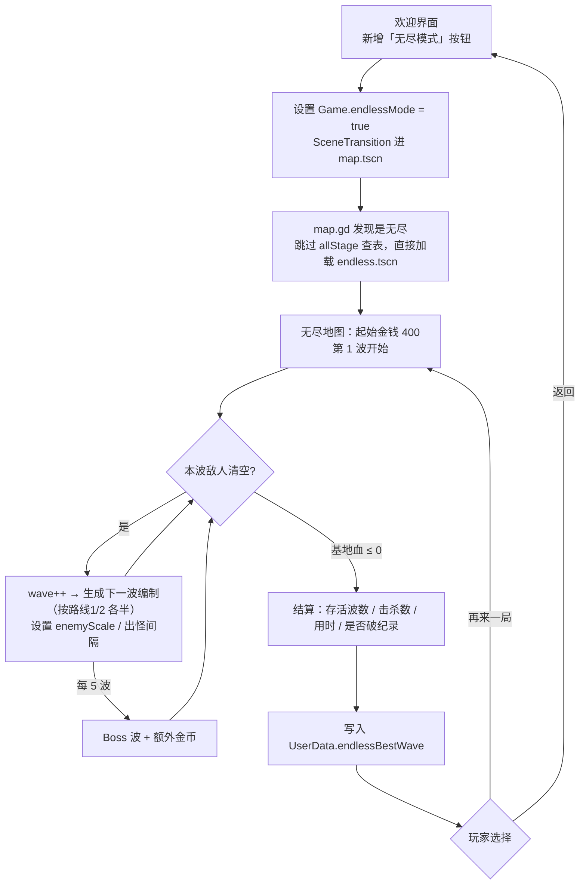

# 无尽模式（Endless Mode）功能设计文档

- 文档状态：**已全部实现（M1~M4）**
  · **M1 代码骨架** ✓：`Game.endlessMode` / 程序化波次生成器 / 难度缩放（`enemyScale` / `enemyAtkScale` / `spawnDelayScale`）/ 欢迎界面入口 / 独立关卡场景。
  · **M2 地图** ✓：`tools/level_tools/make_endless.py` 生成 `scene/level/endless.tscn`（双带并排 U 形、130 条带子、**158 个塔位**、21 件装饰、地面复用现成资源），`analyze.py` **问题数 0**。
  · **M3 曲线** ✓：同屏 18→90、血量 0.15/波、攻击 0.05/波、出怪间隔压到 0.45×、每 5 波 Boss 波、空中兵种每周最多 1 种。
  · **M4 收尾** ✓：击杀数 / 用时统计与最高记录、结算面板显示、暂停菜单「结束本局」、2 条无尽成就、无尽专属介绍页。
  · **M5 地图打磨** ✓：**弯道加可建造区**（105 → 158 格）、上下空带撒 21 件装饰、修掉回程带子 routePhase 方向写反的 bug。
- **v1.2 实现决定**：基地血量 **固定 10**（漏 10 个结束）；同屏上限取 **90**；两条地面带子起终点都在左侧（已确认）。
- **v1.3 变更（M5）**：塔位由「只留中间一片」扩到**三块拐角也给人**（见 §4.2.1）；装饰物从 0 件补到 21 件；回程腿的 `routePhase` 改成**列号递减**（原来和行进方向相反，那两条腿的箭头是倒着跑的）。
- 适用工程：`machine-td/`（Godot 4.7 / GDScript）
- 关联文档：`feature_design.md`（模块实现记录）、`code_design.md`（代码规范）、`game_analysis.md`（现状分析）

**v1.1 变更**：按你的反馈重做地图方案 —— 单带蛇形 → **双传送带并排、只要 2 个弯**；同屏上限 45 → **80**（保底 60+，"气势"优先）；明确**地图不随机**、**每日挑战推迟到 Steam 上线后评估**。

---

## 一、定位与目标

**一句话**：把"打完关卡就没得玩"补上——一局打到基地被拆穿为止，用**最高波数**当成绩，专门承接复玩、成就刷子和以后的排行榜。

**目标（按优先级）**

1. **低成本**：复用现有战斗系统（敌人、塔、技能、传送带、HUD、存档），不新写一套。
2. **要"气势"**：靠**双带并排 + 少弯道**把同屏敌人堆到 **60~80**，视觉上是"两列纵队压过来"，不是"一串小兵在绕圈"。
3. **难度曲线透明**：每 5 波一个小高潮，玩家能清楚感到"自己在变强、敌人在变强"。
4. **可扩展**：把每日挑战 / 排行榜 / 编辑器地图的接口预留出来，本版不实现。

**明确不做（本版范围外）**

- **地图随机化**：已确认先做**固定一张**——固定地图才有练度和记录可比性；随机路线要另做约束求解，工作量翻倍，留 v2。
- **每日挑战**：已确认推迟到 Steam 上线之后再评估。本版只要求把波次生成器写成"`seed` → 编制"的**纯函数**，将来接 seed 即可。
- Steam 排行榜（只预留 `endlessBestWave` 上报接口）
- 无尽专用塔 / 随机词条 / roguelike 元进度
- 新的美术资源（地面、建筑全部复用现有 `factory_floor.tres` 与 `scene/prop/*`）

---

## 二、关键结论：独立场景怎么个"独立"法（⚠️ 先纠正一个前提）

你提到"应该单独一个场景，不使用 map 场景"。**这里有个前提需要澄清**——看现在的代码，`scene/map.tscn` **不是关卡**，它是"外壳"：

| 层 | 文件 | 负责什么 | 实测证据 |
|---|---|---|---|
| 外壳（每局都在用的） | `scene/map.tscn` + `script/map.gd` | 相机、HUD、技能条、塔选择/放置、塔影、结算面板、基地血条、暂停 | `map.gd:146` `levelScene.instantiate()`、`:149` `add_child()` |
| 关卡（每关一个） | `scene/level/level_N.tscn` | 路线 `Path2D`、传送带、可放置区、装饰、波次脚本 | 关卡场景是 `scene/level/base_level.tscn` 的**实例**（`level_1.tscn` 第一行 `instance=ExtResource("1_lv")`） |

所以：

- ✅ **"单独一个场景"= 新增 `scene/level/endless.tscn`（实例化 `base_level.tscn` + 自己的路/带子/塔位 + 自己的脚本）**——和 15 个关卡平级。
- ✅ **仍然要走 `scene/map.tscn` 外壳**——否则相机、HUD、技能、塔影、结算要**再抄一遍**，那是后续所有 bug 的来源。

`map.gd` 现在靠 `StageData.currentStageId` 反查关卡场景（`:131` / `:112`），无尽只需在这条路上加分支：**模式标记为无尽 → 直接加载 `scene/level/endless.tscn`，跳过 `allStage` 查表**。

> 结论：**独立的是"关卡场景"，复用的是"外壳 + 战斗系统"**。核心代码只碰 4 个文件、合计不到 50 行。

---

## 三、文件结构：新增与改动清单

### 新增

| 文件 | 内容 |
|---|---|
| `scene/level/endless.tscn` | 无尽地图场景。实例 `base_level.tscn`（含 `WaveTimer`/`SpawnerTimer`/`TowerShadow`），挂 `endless_level.gd`；自带 **2 条地面路线 + 1 条空中航线** + 传送带 + 可放置区 + 地面/装饰 |
| `script/level/endless_level.gd` | 继承 `base_level.gd`：关掉"通关"判断、**程序化生成每一波**、按 `seed` 决定编制、设置起始金钱/难度缩放/提示航线 |

### 改动

| 文件 | 改什么 | 量级 |
|---|---|---|
| `script/level/base_level.gd` | 抽出两个**钩子**给子类覆写：`_build_wave_spawner(wave)`（默认＝从 `enemyList` 按 `time` 过滤，无尽改成"现场生成"）、`_next_spawn_delay()`（允许乘一个缩放系数） | +10~20 行 |
| `script/enemy/enemy.gd` | `setupEnemyInfo()` 末尾把 `hp / atk` 乘上 `Game.enemyScale`（默认 `1.0`，无尽按波次设置） | +3 行 |
| `autoload/game.gd` | 加 `var endlessMode: bool = false`、`var enemyScale: float = 1.0`（放 `Game` 是因为 `enemy.gd` 已经在读 `Game.enemyInfo`） | +3 行 |
| `script/map.gd` | 无尽分支：加载 `endless.tscn`；**跳过塔种类限制**（`isTowerAllowed`）；技能用全部（`["bombard","invincible"]`）；结算文案/字段不同；**不写关卡评分、不触发关卡通关成就** | +15~25 行 |
| `scene/welcome.tscn` + `script/menu/welcome.gd` | 多一个「无尽模式」按钮 + `_onEndlessPressed()`（照抄 `_onTutorialPressed()` 的写法：设标记 → `SceneTransition.changeScene("res://scene/map.tscn")`） | 1 个节点 + 6 行 |
| `autoload/userData.gd` | `endlessBestWave: int`、`endlessBestKills: int`、`endlessRuns: int` | +3 行 |
| `lang/language.csv` | 新键 8 条（见第七节） | +8 行 |
| `autoload/achievement_manager.gd`（可选，建议做） | 2 条无尽成就：`endless_10`（到第 10 波）、`endless_30`（到第 30 波） | +20 行 |

---

## 四、地图设计（固定一张：双带并排 U 形）

### 4.1 设计原则（按你的反馈重定）

1. **两条传送带并排，各走一条路线（路线1 / 路线2），全程平行**。同屏敌人天然是"两列纵队"，同样数量下比单带蛇形**显多一倍**。
2. **弯道只要 2 个**（一个 U 形回头）。弯道少 → 敌人大部分时间走在直段上 → 视野里同时能看到更多敌人；蛇形那种 4~5 个折返会让"一半敌人在屏幕外排队"，正是你说的"看起来少"。
3. **中间留一大片塔位**：两条平行带子之间的整块区域是**双倍覆盖区**（同一座塔同时打到两条带子）——这是这张图唯一的策略点，也是无尽耐玩的关键。
4. 拐弯只用 90° 直角、每格踩在带子车道中心、两端出屏 ≥64px（沿用三条硬规则，`analyze.py` 校验）。
5. 塔位放宽到 **100~115 格**（普通关卡是 80~95）：这张图要长期复用，塔位太紧会逼死后期打法。

### 4.2 路线规格

```
入口(左, 出屏) ──→ 带子对 row3 ──────────────────────────┐
                  带子对 row4 ──────────────────────────┤  右侧 U 形回头
                                                        │  (col 27 / col 28)
出口(左, 出屏) ←── 带子对 row11 ←─────────────────────────┘
                  带子对 row12 ←─────────────────────────────
```

| 项 | 取值 |
|---|---|
| 路线 1 / 路线 2 | 去程 **row 3 / row 4**（东行）→ 回头后 **row 11 / row 12**（西行）；两条路线**始终相邻并排** |
| 拐弯 | **2 个**（右侧 col 27 / col 28 处，构成一个 U 形回头） |
| 单条路线长度 | ≈ 27（东）+ 9（南）+ 28（西）≈ **64 格**；两条合计 ≈ 128 格路径 |
| 入口 / 出口 | 都在**左边缘外**（`x = -96`）。出屏即可，和关卡里"从右边缘出屏"等价（敌人走完路线＝逃脱扣血） |
| 中间塔位区 | **rows 5~9**（5 行 × col 2~22）＝ 双倍覆盖区 |
| 传送带 | 覆盖全部路线格：东行段 `we`、西行段 `ew`、右侧竖段 `ns`（`animation` 写法与现有关卡一致） |
| 塔位总数 | **158 格**（M5 扩容后的实际值，见 §4.2.1） |
| 空中航线 | 1 条对角航线（左上出屏 → 右下出屏）＝**路线3** |
| 提示航线 | `hintRoutes = [3]`（无尽脚本里直接设，不走 stageData） |

**为什么这样就有"气势"**：同屏 60~80 敌人分摊到两条带子上 ≈ 每条 30~40 个，而单条带子只有 64 格 → **平均每 1.6~2 格一个敌人，从入口到出口几乎不断线**。再叠上"少弯道"（没有拐角处的排队挤压），整条战线都是满的。

> 如果以后想要更长的路：在左端也加一次回头（变成 4 个弯、路线 ≈100 格），代价是左半屏会有敌人走到屏幕外——**不建议**，这条图的价值就在于"全都在看得见的地方走"。

### 4.2.1 可建造区（as built，共 158 格）

M5 之前只有一个中间块，导致**拐弯处完全没法架塔**：竖段在 col28/col29，离塔位区最右边（col22）有 6 格 ≈ 384px，普通塔射程根本够不着，玩家只能眼看敌人在弯道里转圈。M5 把塔位拆成四块：

| 块 | 范围 | 格数 | 干什么用 |
|---|---|---|---|
| 中路双覆盖区 | rows 5~9 × col 2~22 | 105 | 主战场，一座塔同时打到上下两条主路 |
| 内侧拐角区 | rows 5~9 × col 23~27 | 25 | 贴住 col28/col29 两段纵向带子，覆盖进弯与出弯 |
| 右上外侧拐角 | rows 1~2 × col 23~29 | 14 | 骑在 row3 上路外侧与 col29 掉头段，管住"刚进弯"的那一段 |
| 右下外侧拐角 | rows 12~13 × col 23~29 | 14 | 骑在 row11 回程外侧与 col29 掉头段，管住"出弯"的那一段 |

三块拐角都是**紧贴带子的整行/整列**（间距 ≤2 格），普通射程就能覆盖，等于把 U 形弯道整段纳入火力网。塔位总量 105 → **158**，对无尽模式是好事：后期同屏 90 个敌人，火力点更多才守得住；而塔位多不会降难度，因为**钱和人口才是瓶颈**。

### 4.3 视觉

- 地面用 `scene/level/factory_floor.tres`，装饰用现成 `scene/prop/*`（集装箱、冷却塔、变压器、发电机、排风扇、监控屏、警示灯、蒸汽口、焊接火花），**零新增美术**。
- 主题建议定为「**试车跑道 / 报废区**」：一条绕回来的测试道，不需要新素材就能自圆其说（也顺便解释了为什么路线这么规整）。
- **装饰物 21 件（16 小件 + 5 大件）**，全部只落在「既不是路面、也不是塔位」的空格子上（`tools/level_tools/prop_check.py` 复查：贴图压带子 0 处、压塔位 0 处）：
  · 上位空带（row0~2）7 件、U 形靠左窄空地（col0~1，row5~9）2 件、下位空带（row12~16）7 件；
  · 大件 5 件当视觉锚点：`transformer` / `generator` 在上带，`cooling_tower` / `container` / `storage_tank` 在下带。
- 大件场景的 `snapToGrid = false`，所以坐标要写准：**奇数格宽 → 中心落在格中心（≡32），偶数格宽 → 中心压在格线上（≡0）**，这样贴图正好压满整数个格（和官方关卡一致）。

---

## 五、难度曲线设计

这是整个模式唯一真正需要调的数值。**以下都是初值，必须实测调**，所以文档给的是"规则 + 公式"。

### 5.1 兵种解锁表（按波次逐步放开）

| 波次 | 新解锁 | 说明 |
|---|---|---|
| 1 | 迷你坦克 | 只铺路，让玩家把塔立起来 |
| 3 | 突击车 | 快兵，逼玩家把火力往前压 |
| 6 | 中型坦克 | 开始还击（会打塔） |
| 9 | 侦察无人机 | **第一个空中单位**，需要防空 |
| 12 | 自爆车 / 维修车 | 自爆冲塔 + 敌方续航 |
| 15 | 重型坦克 | 高血量考验 |
| 18 | 导弹车 / 攻击直升机 | 远程压制 + 空中持续输出 |
| 22 | 装甲坦克 | 高减伤 |
| 25 | 战斗飞机 | 走空中航线，不扣基地血但要处理 |
| 28 | 实验坦克 | 4 炮塔要塞 |
| 30+ | 全兵种混编 | 进入"看你能撑多久"阶段 |

### 5.2 每波编制规则

```
目标波内敌人总数 = min(18 + 3.2 × (wave - 1), 90)      ← 90 = 同屏上限（实现值，可调）
活跃兵种池       = 最近解锁的 3 种 + 随机 1 种（从已解锁里抽）
每种数量         = min(round(base[类型] × (1 + 0.05 × (wave - 解锁波次))), cap[类型])
兵种分配路线     = 同一兵种**两条路线各分一半**（奇数余 1 个给路线1）→ 两条带子始终都有敌人
Boss 波          = 每 5 波（wave % 5 == 0）
```

| 波次 | 1 | 5 | 10 | 12 | 15 | 20 | 22+ |
|---|---|---|---|---|---|---|---|
| 波内总数 | 16 | 28 | 43 | 49 | 58 | 73 | **80** |

| 类型 | base | cap | 类型 | base | cap |
|---|---|---|---|---|---|
| 迷你坦克 | 8 | 20 | 自爆车 | 3 | 8 |
| 突击车 | 6 | 16 | 维修车 | 2 | 4 |
| 中型坦克 | 4 | 10 | 装甲坦克 | 3 | 8 |
| 侦察无人机 | 4 | 10 | 导弹车 | 2 | 6 |
| 重型坦克 | 3 | 8 | 攻击直升机 | 2 | 6 |
| 战斗飞机 | 2 | 6 | 实验坦克 | 1 | 3 |

（cap 之和 = 105 > 80，所以 80 是可达的；实际每波只用 3~4 种兵，不会真把 12 种全塞进去。）

**Boss 波**：在正常编制上追加"实验坦克 ×1~3（若已解锁）"，本波总数目标 ×1.2（仍受 80 上限约束），清完额外给金币 `30 + 10 × (wave / 5)`。

### 5.3 强度缩放（敌人变强）

| 项 | 公式 | 参考值 |
|---|---|---|
| 血量 | `enemyScale.hp = 1 + 0.15 × (wave - 1)` | W1 = 1.0｜W10 = 2.35｜W20 = 3.85｜W30 = 5.35 |
| 攻击力 | `enemyScale.atk = 1 + 0.05 × (wave - 1)` | W20 = 1.95（打塔更快） |
| 移动速度 | **不缩放** | 缩速度会让传送带动画与敌人速度不匹配，观感立刻崩 |
| 出怪间隔 | `ENEMY_SPAWN_DELAY[类型] × max(0.45, 1 - 0.015 × (wave - 1))` | W1 = 1.0×｜W20 = 0.72×｜W38 起压到 0.45× |

> 血量系数比 v1.0 的 0.12 更陡（0.15）：因为单波敌人从 45 提到 80，玩家击杀收益也几乎翻倍，**如果敌人不变强，中后期会变成"钱多到花不完"的无聊状态**。

### 5.4 玩家侧的成长

| 项 | 取值 | 理由 |
|---|---|---|
| 起始金钱 | **400** | 够立 3~4 座塔，前 5 波不至于被压死 |
| 击杀收益 | 沿用 `enemyInfo.reward` | 数量涨 → 收益自然涨，不需要额外公式 |
| 塔种类限制 | **不限制（7 座全开）** | 无尽是"给你所有工具，看你怎么用" |
| 技能 | **2 个全开**（轰炸 / 无敌） | 技能是应对 Boss 波与 80 敌洪峰的关键 |
| 基地血量 | **固定 10**（比普通关卡的 20 更紧） | 漏 10 个 = 一局结束；配合 90 同屏的洪峰，压力刚好 |
| 进阶奖励 | 每 10 波额外给 1 颗宝石 | 让"进入下一阶段"有正反馈 |

### 5.5 一局的时间预期

| 玩家水平 | 预期波数 | 单局时长 |
|---|---|---|
| 第一次玩 | 8~15 波 | 15~25 分钟 |
| 会玩 | 20~30 波 | 40~70 分钟 |
| 熟练 / 想刷记录 | 35~50 波（被血量缩放卡住） | 80~120 分钟 |

> ⚠️ 单波从 45 涨到 80 个敌人后，**单波时长会明显变长**（一波可能打 3~5 分钟）。
> 两个直接后果：① 暂停菜单里的「**结束本局**」从"可选"变成"必须"；② 结算面板要显示**用时**，玩家才知道自己的进步。
> 另外，无尽最容易犯的错是"后期靠堆血拖时间"——玩家会感到无力而不是紧张。**第 30 波之后应该靠"兵种组合变狠"而不是纯堆血量**，这条要在 M3 实测时专门盯。

---

## 六、玩法流程



**关键点**

1. **不经过关卡选择**：欢迎界面直接进，少一次点击。
2. **不做"通关"**：`base_level.gd` 里 `currWave >= wave` 触发 `Game.lastWaveStarted` —— 无尽把 `wave` 设成一个极大值（或覆写该判断）让它**永不触发**。
3. **波次衔接沿用现有规则**：`_onWaveTimerTimeout()` 已经要求"上一波**全部清空**才开下一波"，这条正好用来控制同屏敌人数量（见第九节）。
4. **结束时走现有结算面板**：`map.gd` 已有 `resultScreen`（`setResult` + 重开/下一关/返回），无尽复用它，只换文案和字段。

---

## 七、UI / 交互 / 文案

### 7.1 界面改动（尽量不新增控件）

| 位置 | 改动 |
|---|---|
| 欢迎界面 | **+1 个按钮**「无尽模式」（放在「开始游戏」下方即可——你说只能多放一个，正好只加一个） |
| 局内 HUD | 复用现有波次显示；**新增一行小字**：`最高记录 第 N 波`；因为单波变长，建议再显示一个**本局击杀数** |
| 暂停菜单 | **增加「结束本局」**（认输 → 直接进结算并记录成绩）——单波 80 敌时这个是必需的 |
| 结算面板 | 字段改为：**存活波数 / 击杀总数 / 用时 / 是否刷新纪录**；按钮：再来一局 / 返回主菜单 |
| 破纪录反馈 | 结算面板标题换成「新纪录！第 N 波」（复用现有标题控件，不新增美术） |

### 7.2 需要新增的翻译键（`lang/language.csv`，三列 `Keys,en,zh`）

| Key | en | zh |
|---|---|---|
| `_Endless` | Endless Mode | 无尽模式 |
| `_EndlessBestFmt` | Best: Wave %s | 最高记录：第 %s 波 |
| `_EndlessResult` | You survived %s waves | 你撑到了第 %s 波 |
| `_EndlessKills` | Total Kills | 击杀总数 |
| `_EndlessTime` | Time | 用时 |
| `_EndlessNewRecord` | New Record! | 新纪录！ |
| `_EndlessGiveUp` | End Run | 结束本局 |
| `_EndlessRetry` | Run Again | 再来一局 |

> 按项目现有约定：**数据层只存键**，显示处一律 `Game.t(key, fallback)`（这轮刚补过 `category` / `description`，别在新功能里再犯一次）。

---

## 八、存档与成就

### 8.1 存档（`autoload/userData.gd`）

```gdscript
var endlessBestWave: int = 0   # 历史最高波数
var endlessBestKills: int = 0  # 对应那局的击杀数
var endlessRuns: int = 0       # 累计游玩次数
```

- 写入时机：结算时与「结束本局」时各写一次，然后 `savePlayerData()`。
- **兼容性**：`player_data.cfg` 读旧档时新字段缺失 → 用默认值 0（落地时确认 `userData.gd` 的读取逻辑对缺失键是回落、不是报错）。
- 预留：以后接 Steam 排行榜，只需要把 `endlessBestWave` 上报，不改存档结构。

### 8.2 成就（可选但建议）

| id | 条件 | 奖励 | 说明 |
|---|---|---|---|
| `endless_10` | 无尽模式到达第 10 波 | 20 宝石 | 门槛低，引导玩家点进去 |
| `endless_30` | 无尽模式到达第 30 波 | 50 宝石 | 长期目标 |

图标沿用现有画法（128×128 准星环 + 四向黄刻度 + 中间徽记），主题建议：波次箭头 / 钟表 / 无限符号。

**另外**：无尽是 `legion_slayer`（3000 击杀）和 `fortress_breaker`（30 辆实验坦克）**最自然的刷取场**——这本身就给了无尽一个存在理由。

---

## 九、性能（同屏 60→80 的关键章节）

你的要求是"同屏起码 60+ 才有气势"，所以本版**把同屏上限从 45 提到 80**。这比现在实测过的峰值高不少：

| 现况 | 数值 |
|---|---|
| 第 15 关（最重） | 18 波 / 321 个敌人，**单波最多约 20 个** |
| 教程关（压力场） | 10 波 / 269 个敌人，**单波约 26 个** |
| **无尽目标** | **单波 90 个 ≈ 现峰值的 4 倍** |

因为"上一波清空才开下一波"，**波内总数就等于同屏上限**，所以 80 是硬指标。

| 风险 | 说明 | 对策 |
|---|---|---|
| **同屏 80** | 每个敌人 = 2 个 AnimatedSprite2D + 1 个雷达 Area2D + 血条 + 计时器 | ① 先把上限做成可调（`低/中/高 = 40 / 60 / 80`，默认 **80**），实测掉帧就降一档；② **非攻击型（`scope = 0`）沿用现有"关闭雷达"逻辑**，能省一半物理检测；③ 血条只在受伤时显示（现有逻辑已如此）；④ 出怪一拍一个（现有 `spawnerTimer`），不会同帧生成 80 个 |
| **导弹拖尾** | 后期 60+ 敌人里会有大量导弹车 / 攻击直升机，**每发导弹都带 `missile_smoke_trail`**，这是最大的隐藏开销 | 压测时专门看这一项；不达标就把拖尾在无尽里降级（减少粒子数或只保留命中端） |
| **死亡特效** | 80 个敌人集中死亡 | 现有 `ExplosionManage` 是**池化**的，不新建节点，正常情况扛得住；压测确认 |
| **数值失衡** | 前期太松 / 后期堆血拖时间 | 导出 W1~W50 的"波内总数 / 总血量 / 兵种"曲线表，确认单调且无跳变；再实测 3 局 |
| **廉价感** | 无尽若只是"把敌人重复刷"，会被评价为凑数 | 必须做：Boss 波 + 每 10 波宝石 + 破纪录反馈 + 最高记录展示 |
| **和关卡系统串味** | 无尽不该写 `stageRatings`、不该触发关卡通关成就（`first_defense` / `perfect_base`） | 在 `map.gd` 的无尽分支里显式跳过这些写入（**落地时逐条确认**） |
| **编辑器并行改动** | 之前的坑：Godot 开着场景时保存会覆盖外部改动 | 搭 `endless.tscn` 前先在编辑器里关掉，搭完再让编辑器加载 |

**压测通过标准**：同屏 80 敌人 + 20 发在飞的导弹，在低端机 / Steam Deck 上 **≥60fps**；不达标就把默认上限降到 60（这仍满足你说的"60+"）。

---

## 十、验证方式

1. **地图规则**（沿用现成工具）：
   ```bash
   python3 tools/level_tools/analyze.py scene/level/endless.tscn
   ```
   要求 **问题数 0**（路线全程走在车道中心、每格都有带子且朝向一致、两端出屏、两条路线都合规）。
2. **波次生成自检**：写脚本按 5.2 / 5.3 的公式导出 W1~W50 的表（波内总数、总血量、兵种构成、出怪间隔、两条路线各多少），确认：数量单调、无空波、两条路线分配均衡、第 50 波总血量在一个"可完成但不轻松"的量级。
3. **实机跑测**（最重要）：至少打完 3 局——一局故意早死、一局到 15 波、一局冲 30+ 波。记录：卡顿点、无解波次、金钱曲线、哪座塔过强。**特别记录"同屏 80 时"的帧率与观感。**
4. **存档**：删掉 `player_data.cfg` 重开一次；再用旧档（没有无尽字段）跑一次，确认不报错、最高记录从 0 起算。
5. **i18n**：新键中英都有值（复用这轮的交叉校验思路：CSV 解析 + 键存在性 + 无重复）。
6. **回归**：15 个关卡 + 教程仍正常，成就、评分、解锁没被无尽串味。

---

## 十一、里程碑（总预估 4~7 个工作日）

| 阶段 | 内容 | 产出验收 |
|---|---|---|
| **M1（1 天）** | 模式开关 + `endless.tscn` 空场景 + `endless_level.gd` 骨架 + `base_level.gd` 两个钩子：能跑起来、能一波波出怪、永不"通关" | 进得去、打得动、基地没了会结算 |
| **M2（1 天）** | 地图搭完：双带并排 U 形 + 全路线带子 + 塔位 + 空中航线；`analyze.py` 过检 | 问题数 0，观感通过（肉眼确认"两列纵队"够密） |
| **M3（1~2 天）** | 难度曲线 + `enemyScale` + 两路分配 + Boss 波 + 结算字段 + 最高记录存档 + i18n | 能完整玩 3 局且曲线合理 |
| **M4（1~1.5 天）** | **性能压测与调优**（同屏 80 是否达标 → 决定默认上限）+ 打磨：破纪录反馈、暂停菜单"结束本局"、2 条成就 | 低端机 60fps；可以拿去给别人试玩 |
| **M5（0.5 天）** | 回归：15 个关卡与教程仍正常、成就/存档无串味 | 全套冒烟通过 |

---

## 十二、本版不做、但要预留接口

| 后续功能 | 现在要预留什么 |
|---|---|
| 每日挑战 | 波次生成器写成"**输入 seed → 输出编制**"的纯函数（本版用固定 seed，将来换日期即可） |
| Steam 排行榜 | `endlessBestWave` 单独存字段，上报逻辑以后加，不改存档结构 |
| 多张无尽地图 / 随机地图 | 地图与逻辑分离（`endless.tscn` 只放地图，规则全在脚本里），以后加 `endless_2.tscn` 即可 |
| 无尽专用词条/塔 | 难度缩放集中在 `Game.enemyScale`，玩家侧增益可以照这个模式再加 `Game.playerScale` |

---

## 十三、已确认的决定 & 还需你拍板的点

**已确认（本稿按这些定稿）**

1. ✅ **只做一张无尽地图，不随机**（固定才有练度与记录可比性）
2. ✅ **双传送带并排、只要 2 个弯**（替代 v1.0 的单带蛇形 5 车道）——为了同屏更多、弯道更少
3. ✅ **同屏 60+ 起步**（本稿默认上限 80，可调 40/60/80）
4. ✅ **每日挑战推迟**到 Steam 上线之后再评估（本版只预留 seed 接口）

**还需你确认**

1. **默认同屏上限先定 80 可以吗？** 我会在 M4 压测；如果低端机掉帧就降到 60（仍满足"60+"）。想更狠就提到 100，但那样得先接受可能要给导弹拖尾做降级。
2. **出口放在左边缘（与入口同侧）观感能接受吗？** 这是"只 2 个弯"的代价。若你更希望敌人往一个方向"走穿全图"，就得把出口放到右下（多 1~2 个弯，同屏会略降）。
3. **难度缩放先按文档值跑**（血量 0.15/波、攻击 0.05/波、起始 400 金）——数值我会在 M3 出一张 W1~W50 的表给你过目，再按实机微调。
