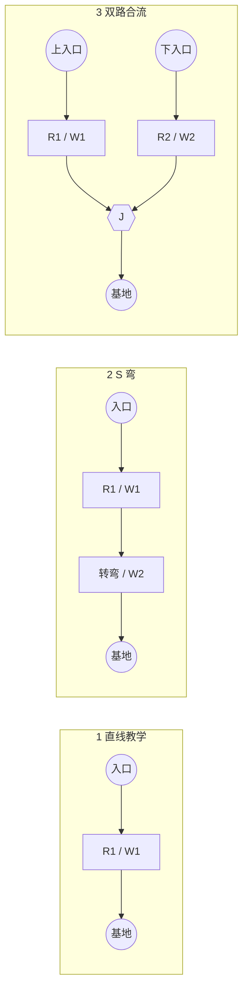
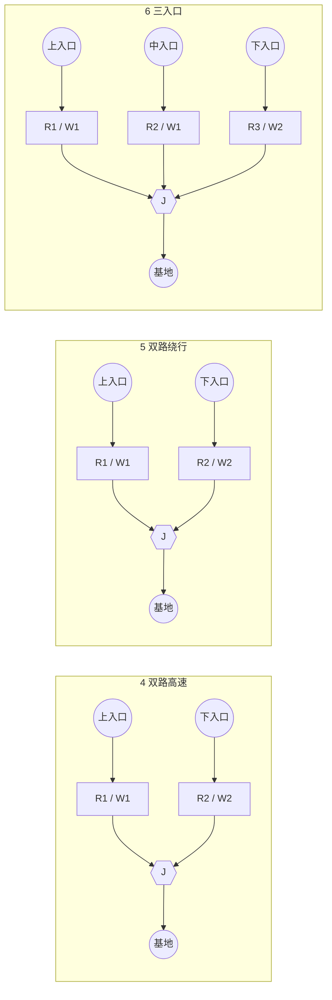
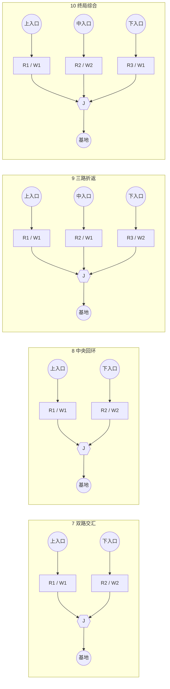

# Machine-TD 塔防游戏项目分析报告

---

## 目录

- [一、项目概述](#一项目概述)
  - [1.1 基本信息](#11-基本信息)
  - [1.2 项目结构](#12-项目结构)
  - [1.3 技术架构](#13-技术架构)
- [二、已实现功能清单](#二已实现功能清单)
  - [2.1 游戏核心系统](#21-游戏核心系统)
  - [2.2 防御塔系统](#22-防御塔系统)
  - [2.3 敌人系统（重新设计 v3 — 与塔伤害类型对齐）](#23-敌人系统重新设计-v3--与塔伤害类型对齐)
    - [2.3.1 设计原则](#231-设计原则)
    - [2.3.2 防御塔伤害类型映射表](#232-防御塔伤害类型映射表与敌人设计的基础)
    - [2.3.3 敌人类型概览](#233-敌人类型概览按对抗性重新分组)
    - [2.3.4 敌人特性细节（新增机制）](#234-敌人特性细节新增机制)
    - [2.3.5 敌人-塔克制矩阵](#235-敌人-塔克制矩阵)
    - [2.3.6 现有敌人功能特性（保留）](#236-现有敌人功能特性保留)
    - [2.3.7 实现要点](#237-实现要点)
  - [2.4 子弹系统](#24-子弹系统)
  - [2.5 UI 界面系统](#25-ui-界面系统)
  - [2.6 其他系统](#26-其他系统)
  - [2.7 关卡地图、敌人路线与塔位设计](#27-关卡地图敌人路线与塔位设计)
- [三、当前问题与缺陷](#三当前问题与缺陷)
  - [3.1 未实现功能（含新增 TODO）](#31-未实现功能含新增-todo)
  - [3.2 代码结构问题](#32-代码结构问题)
- [四、后续开发计划](#四后续开发计划)
  - [4.1 开发路线图](#41-开发路线图)
  - [4.2 Phase 1：核心功能补齐](#42-phase-1核心功能补齐)
  - [4.3 Phase 2：成长与关卡](#43-phase-2成长与关卡)
  - [4.4 Phase 3：体验与打磨](#44-phase-3体验与打磨)
- [五、项目改进建议](#五项目改进建议)
  - [5.1 代码架构优化](#51-代码架构优化)
  - [5.2 开发工具建议](#52-开发工具建议)
  - [5.3 测试建议](#53-测试建议)

---

## 一、项目概述

### 1.1 基本信息

| 项目属性 | 说明 |
|---------|------|
| 项目名称 | machine-TD |
| 游戏类型 | 塔防（Tower Defense） |
| 引擎版本 | Godot Engine 4.5 |
| 编程语言 | GDScript |
| 开发状态 | 开发中（核心玩法已扩展，新增多种塔与UI系统） |

### 1.2 项目结构

```
machine-td/
├── autoload/                    # 全局自动加载脚本
│   ├── game.gd                  # 游戏核心状态管理（含塔/敌人枚举与塔属性表）
│   ├── stageData.gd             # 关卡数据配置（TileSize + 关卡列表）
│   ├── towerUpgradeManager.gd   # 塔升级配置管理器（新增）
│   └── easterEgg.gd             # 彩蛋系统（预留）
├── scene/                       # 场景文件
│   ├── level/                   # 关卡场景
│   │   ├── base_level.tscn      # 关卡基类场景（网格/放置/阴影）
│   │   ├── level_1.tscn         # 第一关
│   │   ├── level_tutorial.tscn  # 教程关卡（新增）
│   │   └── new_tile_set.tres    # 瓦片集资源
│   ├── ui/                      # UI组件场景（新增子目录）
│   │   └── ui_button.tscn       # 通用按钮组件
│   ├── Tower.tscn               # 塔基类场景
│   ├── machineGunTower.tscn     # 机枪塔
│   ├── cannonTower.tscn         # 加农炮塔
│   ├── rocketTower.tscn         # 火箭塔
│   ├── EMPTower.tscn            # EMP电磁塔（新增）
│   ├── teslaCoilTower.tscn      # 特斯拉线圈塔（新增）
│   ├── laserTower.tscn          # 激光塔（新增）
│   ├── droneBase.tscn           # 无人机基地（新增）
│   ├── drone.tscn               # 无人机（新增）
│   ├── aircraft.tscn            # 飞行单位基类（新增）
│   ├── enemy.tscn               # 敌人基类场景
│   ├── miniTank.tscn            # 迷你坦克
│   ├── medium_tank.tscn         # 中型坦克
│   ├── heavy_tank.tscn          # 重型坦克
│   ├── bullet.tscn              # 子弹基类
│   ├── gunBullet.tscn           # 机枪子弹
│   ├── cannon_bullet.tscn       # 加农炮弹
│   ├── rocketbullet.tscn        # 火箭弹
│   ├── bomb.tscn                # 爆炸物
│   ├── explosion.tscn / explosion_manage.tscn  # 爆炸特效管理
│   ├── tower_card.tscn          # 塔卡片UI（新增）
│   ├── tower_icon.tscn          # 塔图标UI（旧版保留）
│   ├── tower_info.tscn          # 塔信息悬浮面板（新增）
│   ├── tower_shadow.tscn        # 塔放置阴影预览
│   ├── tower_ui.tscn            # 塔选择面板
│   ├── level_select.tscn        # 关卡选择界面（新增）
│   ├── level_card.tscn          # 关卡卡片（新增）
│   ├── level_grid.tscn          # 关卡网格布局（新增）
│   ├── level_rating.tscn        # 关卡星级评分（新增）
│   ├── description_panel.tscn   # 描述面板（新增）
│   ├── setting.tscn             # 设置面板（新增）
│   ├── sound_opinion.tscn       # 音量控制条组件（新增）
│   ├── welcome.tscn             # 欢迎界面
│   ├── title.tscn               # 游戏HUD
│   ├── about_panel.tscn         # 关于面板
│   ├── result_screen.tscn       # 结果弹窗
│   ├── map.tscn                 # 主游戏地图
│   ├── life_bar.tscn            # 生命条组件
│   ├── custom_camera.tscn       # 自定义摄像机
│   ├── placeable_area.tscn      # 放置区域
│   ├── sound_manage.tscn        # 音效管理节点
│   ├── toast_info.tscn / toast_label.tscn  # Toast消息组件
│   ├── menuBtn.tscn             # 菜单按钮
│   └── bg.tscn                  # 背景节点
├── script/                      # 脚本文件（50+ 个脚本）
│   ├── tower.gd                 # 防御塔基类（含等级/经验/血量）
│   ├── tower/（内聚到根目录）
│   │   ├── machineGunTower.gd
│   │   ├── cannon_tower.gd
│   │   ├── rocket_tower.gd
│   │   ├── emp_tower.gd         # EMP塔（雷达扫描视觉）
│   │   ├── tesla_coil_tower.gd  # 特斯拉闪电链（特效完成/伤害TODO）
│   │   ├── laser_tower.gd       # 激光塔（多目标激光+电弧）
│   │   └── drone_base.gd        # 无人机基地（生成3架无人机）
│   ├── drone.gd                 # 无人机（围绕飞行+朝向，攻击TODO）
│   ├── aircraft.gd              # 飞行单位基类（血量/速度/雷达）
│   ├── enemy.gd                 # 敌人基类
│   ├── mini_tank.gd / mediumTank.gd / heavyTank.gd
│   ├── bullet.gd / gun_bullet.gd / cannon_bullet.gd / rocketbullet.gd / bomb.gd
│   ├── base_level.gd            # 关卡基类（网格+放置+阴影预览）
│   ├── level_1.gd               # 第一关波次
│   ├── level_tutorial.gd        # 教程关卡（骨架）
│   ├── level_select.gd          # 关卡选择逻辑
│   ├── level_card.gd            # 关卡卡片
│   ├── level_rating.gd          # 星级评分
│   ├── tower_ui.gd              # 塔选择面板（卡片模式+悬浮信息）
│   ├── tower_card.gd            # 塔卡片组件
│   ├── tower_info.gd            # 塔信息悬浮面板
│   ├── tower_icon.gd            # 塔图标（旧版）
│   ├── tower_shadow.gd          # 放置阴影
│   ├── title.gd                 # HUD（开始/暂停/速度/音量/主页信号）
│   ├── welcome.gd               # 欢迎页（跳关卡选择+设置）
│   ├── setting.gd               # 设置面板（音量/语言切换）
│   ├── sound_opinion.gd         # 音量控制（主/BGM/SFX三路）
│   ├── sound_manage.gd          # 音效管理（待实现）
│   ├── map.gd                   # 主游戏控制器
│   ├── result_screen.gd         # 结果弹窗
│   ├── explosion.gd / explosion_manage.gd
│   ├── placeable_area.gd
│   ├── custom_camera.gd
│   ├── life_bar.gd
│   ├── userData.gd              # 用户数据资源（分数/宝石，新增）
│   ├── toast_info.gd / toast_label.gd
│   └── ui_button.gd             # 通用UI按钮
├── sprite/                      # 精灵资源（含塔/敌人/UI图标/瓦片）
├── font/                        # 字体资源（阿里巴巴普惠体）
├── theme/                       # 主题配置
│   ├── theme.tres
│   └── style/                   # 10+ 种样式资源（按钮/卡片/面板）
├── sound/                       # 音效资源（新增）
│   ├── Pickup.wav
│   └── button_on.mp3
├── lang/                        # 多语言（新增）
│   └── language.csv
├── shader/                      # 着色器（新增）
│   └── background.gdshader
├── addons/                      # 插件（toast）
├── default_bus_layout.tres      # 音频总线配置（Master/Bg/Sfx 三路）
├── icon.svg
├── project.godot
└── .editorconfig
```

### 1.3 技术架构

- **全局状态管理**：通过 Autoload 模式实现跨场景数据共享（`Game` / `StageData` / `TowerUpgradeManager`）
- **信号通信机制**：使用 Godot 信号系统实现模块间解耦（defeatEnemy / enemyEscape / selectTower / placeTower / sellTower / clickTower 等）
- **继承体系**：塔和敌人均采用基类 + 派生类设计；新增关卡继承 `base_level.gd`；无人机继承 `aircraft.gd`
- **多尺寸网格放置**：支持 1×1 和 2×2 两种塔尺寸，通过 `coverGrid` / `occupiedArea` 管理占用
- **UI组件化**：塔卡片、关卡卡片、音量条、通用按钮等均以独立场景+脚本封装
- **多语言系统**：基于 CSV 的 `TranslationServer` 语言切换
- **音频总线架构**：Master / Bg / Sfx 三总线独立音量控制
- **Shader视觉特效**：背景着色器 + 塔级 `_draw()` 自绘（激光电弧/闪电链/EMP雷达扫描）

---

## 二、已实现功能清单

### 2.1 游戏核心系统

| 功能模块 | 状态 | 核心文件 |
|---------|------|---------|
| 游戏状态管理 | ✅ | [game.gd](file:///e:/machine-TD/machine-td/autoload/game.gd) |
| 关卡数据配置 | ✅ 扩展 | [stageData.gd](file:///e:/machine-TD/machine-td/autoload/stageData.gd) |
| 塔升级配置骨架 | ✅ 新增 | [towerUpgradeManager.gd](file:///e:/machine-TD/machine-td/autoload/towerUpgradeManager.gd) |
| 关卡基类（网格/放置/阴影） | ✅ 新增 | [base_level.gd](file:///e:/machine-TD/machine-td/script/base_level.gd) |
| 波次生成系统 | ✅ | [level_1.gd](file:///e:/machine-TD/machine-td/script/level_1.gd) |
| 关卡选择界面 | ✅ 新增 | [level_select.gd](file:///e:/machine-TD/machine-td/script/level_select.gd) |
| 用户数据资源 | ✅ 新增骨架 | [userData.gd](file:///e:/machine-TD/machine-td/script/userData.gd) |
| 游戏结束判定 | ✅ | [map.gd](file:///e:/machine-TD/machine-td/script/map.gd) |

### 2.2 防御塔系统

#### 塔类型概览（从 3 种扩展至 7 种，含 1×1 / 2×2）

| 塔类型 | 攻击力 | 攻速(reload) | 成本 | 网格 | 特点 | 脚本文件 |
|-------|--------|-------------|------|------|------|---------|
| 机枪塔 (machineGunTower) | 10 | 0.1s | 10 | 1×1 | 高射速直射 | [machineGunTower.gd](file:///e:/machine-TD/machine-td/script/machineGunTower.gd) |
| 加农炮塔 (cannonTower) | 30 | 0.5s | 20 | 1×1 | 中速直射 | [cannon_tower.gd](file:///e:/machine-TD/machine-td/script/cannon_tower.gd) |
| 火箭塔 (rocketTower) | 20 | 0.5s | 30 | 1×1 | 爆炸范围伤害 | [rocket_tower.gd](file:///e:/machine-TD/machine-td/script/rocket_tower.gd) |
| EMP电磁塔 (EMPTower) | 0 | - | 40 | 1×1 | 减速光环 + 雷达扫描视觉 | [emp_tower.gd](file:///e:/machine-TD/machine-td/script/emp_tower.gd) |
| 无人机基地 (droneBase) | 5 | 5s | 50 | 2×2 | 部署3架无人机围绕攻击 | [drone_base.gd](file:///e:/machine-TD/machine-td/script/drone_base.gd) |
| 特斯拉线圈塔 (teslaCoilTower) | 40 | 2s | 50 | 2×2 | 闪电链最多4跳，特效完成 | [tesla_coil_tower.gd](file:///e:/machine-TD/machine-td/script/tesla_coil_tower.gd) |
| 激光塔 (laserTower) | 4 | 1s | 60 | 2×2 | 同时锁定3目标+电弧激光 | [laser_tower.gd](file:///e:/machine-TD/machine-td/script/laser_tower.gd) |

#### 塔功能特性

- ✅ 自动瞄准敌人（目标列表管理）
- ✅ 雷达范围检测（Area2D area_entered/exited）
- ✅ 炮塔旋转动画（lerp_angle 平滑过渡）
- ✅ 放置阴影预览（tower_shadow + 网格高亮）
- ✅ 多尺寸塔支持（1×1 / 2×2，coverGrid 占用计算）
- ✅ 塔的选中/取消选中（范围圈显示 + 出售按钮）
- ✅ 塔的出售功能（返还 50% 费用）
- ✅ 放置冷却进度条动画（Tween ProgressBar）
- ✅ 塔等级/经验属性（基类预留，升级管理器骨架）
- ✅ 塔血量/最大血量（敌人攻击塔预留）
- ✅ 自绘视觉特效：激光电弧 / 闪电链抖动 / EMP雷达扫描扇形拖尾
- ✅ 无人机围绕飞行轨道算法（多频半径波动 + 角度抖动 + 中心平滑过渡）

### 2.3 敌人系统（重新设计 v3 — 与塔伤害类型对齐）

#### 2.3.1 设计原则

1. **对抗分层（核心）**：敌人分为**推进型（不攻击塔）**与**对抗型（攻击塔）**两大类。推进型只沿路径冲终点，玩家目标是拦截；对抗型会主动攻击防御塔，玩家必须在塔被摧毁前击杀或调整布防。两类混合出场制造"既要拦截推进流、又要保塔不被拆"的双线战术压力。
2. **一塔一克**：每种敌人都有清晰的克制塔型，玩家必须根据波次组合塔而非堆单一塔。
3. **四种伤害交互模型**：物理直射 / AoE 爆炸 / 能量链式 / 减速控制；敌人通过"护甲 / 能量护盾 / 高血量 / 高移速 / 群体"分别克制其中几类。
4. **地面 / 空中分层**：空中单位仅"无人机 + 激光塔"可命中，迫玩家保留空中防御塔。
5. **行为多样性**：对抗型敌人再细分"直射型 / 自爆型 / 干扰型 / 召唤型"，避免攻击方式单一。

#### 2.3.2 防御塔伤害类型映射表（与敌人设计的基础）

| 塔类型 | 伤害类型 | 目标模式 | 可对空 | 克制方向 |
|-------|---------|---------|--------|---------|
| 机枪塔 | 物理直射（高频低伤） | 单体 | ❌ | 高频破盾、清扫低血杂兵 |
| 加农炮塔 | 物理直射（低频高伤） | 单体 | ❌ | 单发秒杀中甲敌人 |
| 火箭塔 | 物理 AoE 爆炸 | 范围 | ❌ | 成群地面敌人、自爆卡车 |
| EMP 电磁塔 | 控制光环（无伤害） | 范围减速 | ❌ | 减速高速敌人/突击车 |
| 无人机基地 | 空中直射（召唤） | 多架追击 | ✅ | 唯一空中追击单位 |
| 特斯拉线圈塔 | 能量链式（4 跳） | 链式多目标 | ❌ | 破能量护盾、清扫群体 |
| 激光塔 | 能量持续（3 目标） | 多目标持续 | ✅ | 破能量护盾、对空持续输出 |

#### 2.3.3 敌人类型概览（按对抗性重新分组）

> 标记：✅=已实现 🟡=部分实现/骨架 🔲=新增设计待实现
> 行为模式：🏃=推进型（不攻击塔） / ⚔=对抗型（主动攻击塔）

##### A. 推进型敌人（不攻击塔，纯路径推进）

玩家目标：在其逃脱前击杀。塔不会被这类敌人攻击，可放心前置布防。

| 敌人类型 | 模式 | 血量 | 速度 | 护甲 | 特性 | 克制塔 | 状态 |
|---------|------|------|------|------|------|--------|------|
| 迷你坦克 (miniTank) | 🏃 | 100 | 中 | 无 | 基础沿路径移动 | 任意塔 | ✅ |
| 重型坦克 (heavyTank) | 🏃 | 600 | 慢 | 中 | 高血量肉盾 | 火箭塔 AoE/特斯拉链 | ✅ |
| 侦察兵 (scout) | 🏃 | 40 | 极快 | 无 | 成群低价、绕路干扰瞄准 | 机枪塔/特斯拉链 | 🔲 |
| 装甲坦克 (armoredTank) | 🏃 | 400 | 慢 | 高 | 物理伤害减免 50% | 特斯拉链/激光（能量穿透） | 🔲 |
| 护盾坦克 (shieldTank) | 🏃 | 300+200 护盾 | 中 | 能量护盾 | 护盾吸收能量伤害 50%，物理直射破盾 | 机枪塔/加农炮（物理破盾） | 🔲 |
| 突击车 (assaultBuggy) | 🏃 | 80 | 极快 | 低 | 难以锁定（turn 速率高） | 激光塔（持续锁定）/EMP减速 | 🔲 |
| 维修车 (medic) | 🏃 | 120 | 中 | 无 | 范围内回血光环（每秒 +5%） | 加农炮（优先秒杀）/特斯拉链 | 🔲 |
| 侦察无人机 (scoutDrone) | 🏃 | 30 | 快 | 无 | 仅无人机/激光可命中，低成本干扰空中防御 | 无人机基地/激光塔 | 🔲 |
| 运输机 (transport) | 🏃 | 400 | 慢 | 无 | 沿独立空中路径飞行，途中空投地面敌人 | 激光塔（高伤对空）/无人机 | 🔲 |

##### B. 对抗型敌人（主动攻击塔）

玩家目标：在塔被摧毁前击杀或调整阵型。塔有 hp 属性（已预留），被攻击会扣血归零后失效。
**对抗方式细分**（共 5 类）：直射型（中近程子弹）/ 远程打击型（远距离定点/追踪轰击）/ 自爆型（接近引爆）/ 空中支援型（不直接攻击塔，给地面敌人加光环+空投）/ 召唤型（BOSS 召唤护航）。

**B.1 地面近战直射型** — 中近程直接射击塔，需用高 DPS 或单体高伤塔快速击杀

| 敌人类型 | 模式 | 对抗方式 | 血量 | 速度 | 特性 | 克制塔 | 状态 |
|---------|------|---------|------|------|------|--------|------|
| 中型坦克 (mediumTank) | ⚔ | 直射型 | 200 | 中 | 炮塔旋转朝塔 + 子弹射击（fire TODO） | 机枪塔/加农炮 | 🟡 |
| 突击兵 (assaultSoldier) | ⚔ | 直射型 | 150 | 快 | 快速突进接近塔后高频射击（原工程兵改，直接攻击塔） | 机枪塔（高频秒杀）/特斯拉链/EMP减速保塔 | 🔲 |

**B.2 地面远程打击型（新增）** — 远距离定点/追踪轰击塔，移动慢，需远程塔先手对轰

| 敌人类型 | 模式 | 对抗方式 | 血量 | 速度 | 特性 | 克制塔 | 状态 |
|---------|------|---------|------|------|------|--------|------|
| 远程炮兵 (artillery) | ⚔ | 远程打击型 | 250 | 慢 | 远距离定点炮击塔，射程 > 普通塔 radar，需远程塔对轰 | 激光塔（远程持续）/火箭塔 AoE 先手 | 🔲 |
| 导弹车 (missileTruck) | ⚔ | 远程打击型 | 180 | 慢 | 发射追踪导弹，可绕过前排塔打后排关键塔 | 激光塔（多目标拦截导弹+本体）/无人机追击 | 🔲 |

**B.3 地面自爆型**

| 敌人类型 | 模式 | 对抗方式 | 血量 | 速度 | 特性 | 克制塔 | 状态 |
|---------|------|---------|------|------|------|--------|------|
| 自爆卡车 (suicideBomber) | ⚔ | 自爆型 | 60 | 快 | 接近塔自爆，对塔范围伤害 | 火箭塔（远距离 AoE 先手）/激光塔 | 🔲 |

**B.4 空中直射型** — 空中对抗型，直接攻击塔，仅无人机/激光可命中

| 敌人类型 | 模式 | 对抗方式 | 血量 | 速度 | 特性 | 克制塔 | 状态 |
|---------|------|---------|------|------|------|--------|------|
| 轰炸机 (bomber) | ⚔ | 直射型 | 200 | 慢 | 定期投弹对塔范围伤害，必须提前击落 | 激光塔（持续对空）/无人机追击 | 🔲 |
| 攻击直升机 (attackHelicopter) | ⚔ | 直射型 | 280 | 中 | 悬停锁定单塔高频扫射，低伤高频 | 激光塔（持续对空）/无人机追击 | 🔲 |

**B.5 空中支援型（新增）** — 不直接攻击塔，给地面敌人加光环/空投杂兵，不击落则地面敌人变强

| 敌人类型 | 模式 | 对抗方式 | 血量 | 速度 | 特性 | 克制塔 | 状态 |
|---------|------|---------|------|------|------|--------|------|
| 空中支援机 (supportCraft) | ⚔ | 空中支援型 | 350 | 慢 | 给路径上地面敌人加护盾+加速光环，并周期空投杂兵 | 激光塔（高伤对空优先击落）/无人机 | 🔲 |

**B.6 BOSS**

| 敌人类型 | 模式 | 对抗方式 | 血量 | 速度 | 特性 | 克制塔 | 状态 |
|---------|------|---------|------|------|------|--------|------|
| 重装 BOSS (heavyMech) | ⚔ | 直射+召唤 | 3000 | 慢 | 三阶段：召唤杂兵 → 能量护盾期 → 狂暴加速扫射塔 | 全塔协同（EMP减速+特斯拉破盾+火箭AoE） | 🔲 |
| 双形态 BOSS (transformerBoss) | ⚔ | 直射+召唤 | 2500 | 中 | 地空切换攻击塔，召唤杂兵护航 | 无人机+激光（空）+加农炮（地） | 🔲 |
| 空中 BOSS (gunship) | ⚔ | 直射+召唤 | 1500 | 中 | 持续扫射塔 + 召唤侦察无人机 | 激光塔+无人机协同 | 🔲 |

> 注：原"工程兵 (engineer)"已改为"突击兵 (assaultSoldier)"——直接攻击塔比放路障干扰对抗感更强；原"飞行单位基类 (Aircraft)"为基类不直接出场，其血量/速度/雷达字段供 A、B 两组空中单位继承。

#### 2.3.4 敌人特性细节（新增机制）

**A. 推进型特性**（不涉及攻击塔）

| 特性 | 描述 | 实现要点 |
|------|------|---------|
| **护甲 (armor)** | 物理伤害减免百分比；能量伤害无视护甲 | enemy.gd 增 `armor` 字段，`hurt()` 区分 damageType |
| **能量护盾 (shield)** | 吸收能量伤害；物理直射可快速破盾 | 双血条（hp + shield），破盾后暴露本体 |
| **回血光环 (healAura)** | 维修车周围敌人每秒回血百分比 | Area2D 检测同类，定时器加血 |
| **空中飞行 (flying)** | 独立飞行路径，仅无人机/激光可命中 | 碰撞层/mask 区分，普通塔 radar 不检测 |
| **绕路/突进 (dash)** | 突击车短距突进，提高 turn 速率避开瞄准 | lerp_angle 提速或路径段切换 |
| **召唤杂兵 (summon)** | 运输机定时在路径节点空投地面敌人 | 定时器 + StageData 预载敌人场景 |

**B. 对抗型特性**（核心：攻击塔的差异化方式，共 5 类）

| 对抗方式 | 描述 | 涉及敌人 | 实现要点 |
|---------|------|---------|---------|
| **直射型 (towerShoot)** | 中近程向锁定塔发射子弹（地面/空中均适用） | 中型坦克、突击兵、轰炸机、攻击直升机、重装 BOSS、空中 BOSS、双形态 BOSS | bulletType.enemy 子弹 + 塔层碰撞；tower.gd 补 `hurt(dmg)`，hp 归零 queue_free |
| **远程打击型 (artilleryStrike)** | 远距离定点/追踪轰击塔，射程 > 普通塔 radar，迫使玩家用远程塔先手对轰 | 远程炮兵、导弹车 | 远程高伤低速子弹；追踪导弹可绕过前排塔直击后排关键塔（激光多目标可同时拦截导弹+本体） |
| **自爆型 (kamikaze)** | 接近塔后引爆自身，对塔范围伤害 | 自爆卡车 | 接近检测 + 借用 bomb.gd 爆炸逻辑，目标切到塔层 |
| **空中支援型 (airSupport)** | 不直接攻击塔，给地面敌人加护盾/加速光环 + 周期空投杂兵，不击落则地面敌人变强 | 空中支援机 | Area2D 光环作用于地面敌人属性 + 定时空投；仅无人机/激光可命中 |
| **召唤型 (spawn)** | 召唤推进型杂兵护航或对抗型支援 | 重装 BOSS、双形态 BOSS、空中 BOSS、空中支援机 | 阶段触发 + StageData 召唤表 |
| **形态切换 (transform)** | BOSS 地空切换，改变碰撞层与可命中塔 | 双形态 BOSS | 阶段定时器 + layer/mask 切换 |

> **塔的对应机制**：`tower.gd` 已有 `hp` / `maxHp` 字段，需补 `hurt(damage)` 方法（扣血 → 血条 → 归零 queue_free + 爆炸特效 + 释放 coverGrid）；EMP 塔减速光环同样作用于对抗型敌人，可降低其开火频率与移动速度，是保塔的关键控制塔；远程打击型敌人出现后，玩家必须保留激光塔/火箭塔作为"反炮兵"远程火力，否则后排关键塔会被定点摧毁。

#### 2.3.5 敌人-塔克制矩阵

> 图例：✅ 克制（伤害最大化）/ ◯ 普通（可命中）/ ⚠ 被克（伤害减免或不命中）/ — 无法命中
> 分组：🏃=推进型 / ⚔=对抗型（会攻击塔，需优先处理或保塔）

| 敌人 \ 塔 | 模式 | 机枪 | 加农炮 | 火箭 | EMP | 无人机 | 特斯拉 | 激光 |
|----------|------|------|--------|------|-----|--------|--------|------|
| 迷你坦克 | 🏃 | ✅ | ✅ | ✅ | ◯ | ◯ | ✅ | ✅ |
| 重型坦克 | 🏃 | ⚠ | ⚠ | ✅ | ◯ | ⚠ | ✅ | ✅ |
| 侦察兵 | 🏃 | ✅ | ⚠ | ◯ | ◯ | ⚠ | ✅ | ◯ |
| 装甲坦克 | 🏃 | ⚠ | ⚠ | ⚠ | ◯ | ⚠ | ✅ | ✅ |
| 护盾坦克 | 🏃 | ✅ | ✅ | ◯ | ◯ | ⚠ | ⚠ | ⚠ |
| 突击车 | 🏃 | ⚠ | ⚠ | ⚠ | ✅ | ⚠ | ⚠ | ✅ |
| 维修车 | 🏃 | ✅ | ✅ | ◯ | ◯ | ◯ | ✅ | ◯ |
| 侦察无人机 | 🏃 | — | — | — | — | ✅ | — | ✅ |
| 运输机 | 🏃 | — | — | — | — | ◯ | — | ✅ |
| 中型坦克 | ⚔ | ✅ | ✅ | ◯ | ◯ | ◯ | ◯ | ◯ |
| 突击兵 | ⚔ | ✅ | ⚠ | ✅ | ✅ | ◯ | ✅ | ✅ |
| 远程炮兵 | ⚔ | ⚠ | ⚠ | ✅ | ◯ | ⚠ | ◯ | ✅ |
| 导弹车 | ⚔ | ⚠ | ⚠ | ◯ | ◯ | ✅ | ◯ | ✅ |
| 自爆卡车 | ⚔ | ⚠ | ⚠ | ✅ | ◯ | ⚠ | ◯ | ✅ |
| 重装 BOSS | ⚔ | ⚠ | ◯ | ✅ | ✅ | ◯ | ✅ | ✅ |
| 双形态 BOSS | ⚔ | ⚠ | ✅ | ◯ | ◯ | ✅ | ◯ | ✅ |
| 轰炸机 | ⚔ | — | — | — | — | ◯ | — | ✅ |
| 攻击直升机 | ⚔ | — | — | — | — | ◯ | — | ✅ |
| 空中支援机 | ⚔ | — | — | — | — | ◯ | — | ✅ |
| 空中 BOSS | ⚔ | — | — | — | — | ◯ | — | ✅ |

> 对抗型敌人需结合"能否快速击杀"与"塔能否抗住其攻击"双维度评估：EMP 对所有对抗型都标 ✅/◯（减速既保命又保塔），是阵型核心；远程打击型（远程炮兵/导弹车）出现后，激光塔成为唯一能跨射程对轰的反炮兵塔，必须保留。

#### 2.3.6 现有敌人功能特性（保留）

- ✅ 沿 PathFollow2D 路径移动（progress 累加）
- ✅ 血量条显示（life_bar 组件）
- ✅ 受伤和死亡处理（hurt 方法 + 爆炸特效）
- ✅ 爆炸效果触发（ExplosionManage）
- ✅ 逃脱扣除生命值（enemyEscape 信号）
- ✅ 中型坦克炮塔旋转朝向目标（fire 方法框架接入，具体发射TODO）

#### 2.3.7 实现要点

| 模块 | 改动 |
|------|------|
| `Game.enemyType` 枚举 | 扩展：scout, armoredTank, shieldTank, assaultBuggy, suicideBomber, medic, assaultSoldier, artillery, missileTruck, heavyMech, transformerBoss, scoutDrone, bomber, attackHelicopter, supportCraft, transport, gunship |
| `Game.bulletType` 枚举 | 新增 `air`（区分空中子弹），地面塔子弹 mask 不命中飞行敌人 |
| `Enemy` 基类 | 新增 `armor`、`shield`、`damageType` 接收参数；`hurt()` 按伤害类型分流计算 |
| `aircraft.gd` | 补全独立飞行路径（非 PathFollow2D）、`hurt()`、奖励、逃脱处理；新增光环/空投接口供 supportCraft 继承 |
| 碰撞层 | 拆分：地面敌人层 / 空中敌人层 / 塔层；地面塔 radar mask 仅含地面层 |
| 敌方子弹 | 复用 `bullet.gd`，bulletType.enemy，碰撞层切到塔层，命中调用 `tower.hurt()`；远程打击型子弹新增 `tracking`（追踪导弹）与 `siege`（定点炮弹）变种 |
| 敌方光环 | supportCraft 的护盾/加速光环作用于地面敌人：Area2D area_entered 给敌人 `armor`/`shield`/`speed` 临时加成，area_exited 移除 |
| `StageData` | 新增敌人场景 preload 列表 + BOSS/支援机配置字段（召唤表/阶段触发/光环参数） |
| `level_1.gd._on_spawner_timer_timeout()` | 当前仅实例化 miniTank，需扩展至全部新敌人类型分支 |

### 2.4 子弹系统

| 子弹类型 | 伤害 | 速度 | 存活时间 | 特点 |
|---------|------|------|---------|------|
| gunBullet | 20 | 500 | 3s | 直射，命中即消失 |
| cannonBullet | 30 | 500 | 3s | 直射，命中即消失 |
| rocketBullet | 40 | 300 | 5s | 命中产生 bomb 爆炸范围伤害 |
| 激光伤害 | 4 | 持续 | - | laser_tower 直接对 3 目标调用 hurt()，无实体子弹 |
| 闪电链伤害 | 40 | - | - | tesla_coil_tower 链 4 目标，伤害 TODO（仅特效） |

### 2.5 UI 界面系统

| 界面 | 状态 | 核心文件 |
|------|------|---------|
| 欢迎界面 | ✅ 扩展 | [welcome.gd](file:///e:/machine-TD/machine-td/script/welcome.gd) |
| 游戏 HUD | ✅ 扩展 | [title.gd](file:///e:/machine-TD/machine-td/script/title.gd) |
| 塔选择面板（卡片式） | ✅ 重写 | [tower_ui.gd](file:///e:/machine-TD/machine-td/script/tower_ui.gd) |
| 塔卡片组件 | ✅ 新增 | [tower_card.gd](file:///e:/machine-TD/machine-td/script/tower_card.gd) |
| 塔信息悬浮面板 | ✅ 新增 | [tower_info.gd](file:///e:/machine-TD/machine-td/script/tower_info.gd) |
| 关卡选择界面 | ✅ 新增 | [level_select.gd](file:///e:/machine-TD/machine-td/script/level_select.gd) |
| 关卡卡片 + 星级 | ✅ 新增 | [level_card.gd](file:///e:/machine-TD/machine-td/script/level_card.gd) / [level_rating.gd](file:///e:/machine-TD/machine-td/script/level_rating.gd) |
| 设置面板（音量/语言） | ✅ 新增 | [setting.gd](file:///e:/machine-TD/machine-td/script/setting.gd) |
| 音量控制条组件 | ✅ 新增 | [sound_opinion.gd](file:///e:/machine-TD/machine-td/script/sound_opinion.gd) |
| 描述面板 | ✅ 新增 | description_panel.tscn |
| 结果弹窗 | ✅ | [result_screen.gd](file:///e:/machine-TD/machine-td/script/result_screen.gd) |
| 关于面板 | ✅ | about_panel.tscn |
| Toast 消息提示 | ✅ 扩展 | [toast_info.gd](file:///e:/machine-TD/machine-td/script/toast_info.gd) |

#### UI 细节说明

- **塔选择面板**：折叠/展开动画（show/hide），卡片化展示所有 7 种塔，鼠标进入显示塔详情悬浮面板（含屏幕边界自适应定位）
- **HUD**：开始/暂停切换按钮（TextureButton toggled）、1X/2X 速度切换、音效开关、音乐开关、主页按钮（信号全部 emit，map.gd 待实现槽方法）
- **设置面板**：Master / Bg / Sfx 三路音量滑条（连接 AudioServer 总线 dB 值）+ 语言下拉切换（TranslationServer.set_locale），已接入中文/英文 locale 检测
- **关卡选择**：根据 StageData.allStage 动态生成关卡卡片，按 12 个一行分页，返回按钮跳回欢迎页

### 2.6 其他系统

| 系统 | 状态 | 说明 |
|------|------|------|
| 网格放置系统 | ✅ 重写 | [base_level.gd](file:///e:/machine-TD/machine-td/script/base_level.gd) 实现 world2Grid / canPlace / getTowerCoverGrid，支持 1×1 与 2×2 |
| 爆炸效果管理 | ✅ | [explosion_manage.gd](file:///e:/machine-TD/machine-td/script/explosion_manage.gd) |
| Toast 消息插件 | ✅ | 第三方插件集成 + 自定义 toast_info 封装 |
| 自定义摄像机 | ✅ | [custom_camera.gd](file:///e:/machine-TD/machine-td/script/custom_camera.gd) |
| 多语言系统 | ✅ 新增 | `lang/language.csv` + setting.gd 语言切换 + OS.get_locale_language() 自动检测 |
| 音频总线架构 | ✅ 新增 | `default_bus_layout.tres` 三路总线 + sound_opinion.gd 控制 |
| 背景着色器 | ✅ 新增 | [background.gdshader](file:///e:/machine-TD/machine-td/shader/background.gdshader) |
| 主题样式库 | ✅ 扩展 | 10+ 种 .tres 样式（按钮/卡片/面板/描述框） |
| 音效资源 | ✅ 新增骨架 | sound/ 目录下 2 个音频文件（待接入播放） |

### 2.7 关卡地图、敌人路线与塔位设计

#### 2.7.1 统一地图规则

所有关卡使用 30×16 网格，单格大小为 64 px，地图尺寸为 1920×1024 px。
坐标原点在地图左上角，坐标格式为 `(x, y)`，路线节点和塔位均使用网格坐标。

- **敌人入口**：默认从左侧进入，可设置上入口 `(0,2)`、中入口 `(0,7)` 和下入口 `(0,12)`；多个入口最终必须汇入同一个基地。
- **基地**：`(29, 7)`，所有路线最终汇入该位置；敌人到达后扣除基地生命并销毁。
- **基地安全区**：`x=27..29、y=6..8`，禁止放塔，避免塔遮挡基地和终点判定。
- **路线数量**：一张地图可以有 1 至 3 条路线。路线可以独立进入基地，也可以在中段合流；合流后不再分叉，避免敌人到达基地时出现多个终点判定。
- **路线宽度**：每条路线明确标记为 1 格或 2 格。1 格路线只占中心格；2 格路线占相邻的两格。转弯处使用外扩后的矩形保护区，禁止塔放置。
- **路线保护区**：路线占用格外，再向两侧增加 1 格缓冲区；两格路线的缓冲区不能与另一条路线重叠，否则应视为合流点。
- **普通塔位**：1×1 塔使用一个 `T` 格。
- **大型塔位**：2×2 塔使用标记点周围的 2×2 格，推荐只放在 `L` 区域；标记点采用右下对齐规则，落点前必须调用 `getTowerCoverGrid()` 检查。
- **塔位间隔**：相邻塔位至少间隔 1 格，避免多个塔的雷达范围完全重叠。
- **分流原则**：第 1 关保持单路线教学；第 2 至 6 关逐步加入宽路线、分叉和合流；第 7 至 10 关使用多入口、多路线和交错交火区，但始终只有一个基地。

图例：`S` 入口，`R1/R2` 路线编号，`W1/W2` 表示 1 格/2 格路线，`J` 合流点，`B` 基地，`T` 普通塔位，`L` 大型塔位，`-` 不可建造区域。

#### 2.7.2 路线与布防总览

下表中的“路线”按敌人行进顺序连接，路线节点之间使用水平或垂直线段。塔位是推荐位置，不代表强制位置；实际放置仍由网格碰撞规则校验。

| 关卡 | 地图主题与战术目标 | 敌人路线节点 | 推荐普通塔位 T | 推荐大型塔位 L | 基地 |
|------|------------------|--------------|----------------|----------------|------|
| 1 | 直线教学，学习前置火力 | R1/W1：`(0,7) → (29,7)` | `(6,5),(10,9),(15,5),(19,9),(24,5)` | `(12,4),(21,8)` | `(29,7)` |
| 2 | 单路线 S 弯，首次加入 2 格路段 | R1/W1：`(0,3) → (8,3) → (8,11) → (18,11) → (18,7) → (29,7)`；中段 `(8,3)→(8,11)` 为 W2 | `(5,5),(6,9),(11,5),(15,9),(21,5),(24,9)` | `(10,4),(20,8)` | `(29,7)` |
| 3 | 上下两路在中段合流，练习分区防守 | R1/W1：`(0,3) → (12,3) → (18,7)`；R2/W2：`(0,11) → (12,11) → (18,7)`；J：`(18,7) → (29,7)` | `(5,5),(10,5),(15,5),(5,9),(10,9),(15,9),(23,5)` | `(12,2),(12,10),(21,8)` | `(29,7)` |
| 4 | 两条高速路线，依赖减速和范围伤害 | R1/W1：`(0,2) → (7,2) → (14,7) → (29,7)`；R2/W2：`(0,12) → (7,12) → (14,7)` | `(3,4),(8,4),(11,6),(3,10),(8,10),(18,5),(24,9)` | `(10,1),(10,11),(21,8)` | `(29,7)` |
| 5 | 双路绕行，保护中段和末端塔群 | R1/W1：`(0,4) → (5,4) → (5,10) → (21,10) → (29,7)`；R2/W2：`(0,10) → (5,10)` 后合流；中段为 W2 | `(3,2),(9,2),(15,2),(21,5),(23,9),(26,5)` | `(11,1),(18,9)` | `(29,7)` |
| 6 | 三入口空地混合，扩大对空覆盖 | R1/W1：`(0,2) → (10,2) → (18,7)`；R2/W1：`(0,7) → (18,7)`；R3/W2：`(0,12) → (10,12) → (18,7)`；J 后至基地 | `(5,4),(10,4),(14,5),(5,10),(10,10),(14,9),(23,5)` | `(7,1),(13,11),(21,8)` | `(29,7)` |
| 7 | 双路分离后交错汇合，考验分区布防 | R1/W1：`(0,3) → (14,3) → (14,7)`；R2/W2：`(0,11) → (14,11) → (14,7)`；J：`(14,7) → (29,7)` | `(5,1),(9,5),(18,5),(22,5),(5,9),(9,13),(18,9),(23,9)` | `(12,2),(12,10),(20,6)` | `(29,7)` |
| 8 | 中央回环，两路在不同时间点交叉 | R1/W1：`(0,2) → (6,2) → (23,2) → (23,7)`；R2/W2：`(0,12) → (6,12) → (23,12) → (23,7)`；J 后至基地 | `(3,4),(9,4),(16,4),(20,5),(20,10),(15,10),(8,10),(25,5)` | `(10,1),(18,11)` | `(29,7)` |
| 9 | 三入口三路折返，区分前线、核心、末端 | R1/W1：`(0,1) → (26,1) → (26,7)`；R2/W1：`(0,7) → (26,7)`；R3/W2：`(0,14) → (8,14) → (8,7) → (26,7)`；J 后至基地 | `(7,3),(15,3),(22,3),(8,5),(15,9),(22,11),(26,11)` | `(12,2),(19,10)` | `(29,7)` |
| 10 | 终局多路综合图，路线宽度动态变化 | R1/W1：`(0,2) → (15,2) → (15,7)`；R2/W2：`(0,7) → (15,7)`；R3/W1：`(0,12) → (15,12) → (15,7)`；J/W2：`(15,7) → (26,7) → (29,7)` | `(2,4),(8,4),(12,4),(18,4),(22,10),(18,10),(10,10),(26,5)` | `(10,1),(20,11),(24,5)` | `(29,7)` |

#### 2.7.3 各关卡路线缩略图

使用 Mermaid 表达路线拓扑，比纯文本草图更容易区分入口、分路、宽路线和基地。`W1` 为 1 格路线，`W2` 为 2 格路线，`J` 为合流点；箭头方向为敌人前进方向。实际游戏内再根据同一份地图数据生成 SVG 或 PNG 缩略图。







**游戏内缩略图建议**：每关制作一张 480×270 的 SVG/PNG 预览图，使用深色背景、浅色路线和高对比图标；不同路线使用蓝/橙/青三种颜色，路线宽度直接用 1 倍/2 倍描边表示。入口使用箭头图标，基地使用盾牌图标，合流点使用圆形节点，普通塔位使用小方点，大型塔位使用 2×2 方框。缩略图只展示路线和关键塔位，不显示敌人数量，避免玩家在选关界面看到过多信息。

建议缩略图与 `StageData` 使用相同的 `map.routes`、`towerSlots`、`largeTowerSlots` 数据生成，避免文档、选关界面和实际地图出现路线不一致。关卡场景中的路线颜色、塔位颜色和缩略图应共用同一组颜色常量。

#### 2.7.3.1 地图辨识度表现方案

ASCII 草图适合表达路线拓扑，但不适合作为最终地图预览。每关增加一张简单的地图缩略图或场景预览，使用“背景地标 + 路线样式 + 入口/基地图标”建立辨识度。暂时没有完整美术时，也可以先用 TileMap 色块、`Line2D` 和简单 SVG 图标完成。

**推荐的三层表现：**

1. **背景层**：使用 2 至 3 个大色块表现地图主题，例如仓库、峡谷、工业区或空军基地；重点是区分关卡，不需要复杂贴图。
2. **路线层**：1 格路线使用细实线，2 格路线使用粗实线；多路线使用不同颜色或边缘纹理，合流点使用圆形 `J` 标记。
3. **功能点层**：入口使用箭头图标，基地使用盾牌或核心图标，塔位使用淡色圆点或方框。塔位预览不能遮挡路线和基地图标。

**十关缩略图主题：**

| 关卡 | 缩略图主题 | 主色 | 识别元素 | 路线表现 |
|------|------------|------|----------|----------|
| 1 | 新手训练场 | 草地绿 | 标准靶场、单基地 | 单条细蓝线 |
| 2 | S 形仓储区 | 铁锈橙 | 集装箱、转角警示牌 | 转弯处增加黄色箭头 |
| 3 | 双坡谷地 | 岩石灰 | 上下坡、中央桥梁 | 蓝/青两路在桥头汇合 |
| 4 | 高速公路 | 沥青黑 | 道路虚线、测速标志 | 2 格路线使用宽黄线 |
| 5 | 导弹工厂 | 工业红 | 厂房、油罐、警戒条 | 路线增加红色危险边框 |
| 6 | 空地前哨 | 沙漠黄 | 雷达、停机坪 | 三个入口使用三种箭头颜色 |
| 7 | 双门防区 | 军事绿 | 两座闸门、中央检查站 | 上下路线对称后合流 |
| 8 | 中央环城 | 夜蓝 | 环形高架、照明灯 | 回环使用发光边线和方向箭头 |
| 9 | 三路峡口 | 紫灰 | 三个峡口、中央隘口 | 三路线使用不同纹理 |
| 10 | 终局核心区 | 黑红 | 能量核心、警报灯、重型闸门 | 主路线使用粗红线，合流点高亮 |

**游戏内缩略图结构：**

```text
+--------------------------------------------------+
| 关卡标题                         [地图主题图标]  |
|                                                  |
| 入口 ▶ ──── 路线 1 ────────┐                    |
| 入口 ▶ ════ 路线 2 ════════╪══ [基地核心]      |
|                    [合流点] ┘                    |
|       · T      · T       ■ L                    |
+--------------------------------------------------+
```

建议新增 `scene/level/map_preview.tscn` 作为关卡选择界面的缩略图组件，包含背景 `TextureRect`、路线 `Line2D`、入口图标、基地图标和塔位标记。每个关卡只需替换背景图、路线点、颜色和地标图标，不必制作完整独立场景。

建议在关卡数据中增加轻量视觉字段：

```gdscript
"visual": {
  "theme": "industrial",
  "background": "res://sprite/map/map_05.png",
  "route_colors": [Color("e8a33a"), Color("d94b45")],
  "landmark": "factory",
  "route_labels": ["R1", "R2"]
}
```

缩略图和实际战斗地图必须共用同一份 `routes`、`towerSlots` 和 `largeTowerSlots` 数据；装饰图片只负责视觉表现，不参与碰撞、路径或塔位判定。

#### 2.7.4 塔位功能分区

每张地图的推荐塔位应按距离基地的远近承担不同职责：

| 区域 | 推荐位置 | 适合塔型 | 设计目的 |
|------|----------|----------|----------|
| 前线区 | 入口后第 3 至 8 格 | 机枪塔、EMP塔 | 提前减速并削弱小型高速敌人 |
| 中段区 | 第一个拐角或路线交汇处 | 火箭塔、Tesla塔、加农炮塔 | 利用敌人聚集造成范围或链式伤害 |
| 核心区 | 路线回折内侧 | 激光塔、无人机基地 | 提供长时间、多目标和对空覆盖 |
| 末端区 | 基地前 4 至 6 格 | 加农炮塔、激光塔 | 处理漏网重型敌人和最后一波 |

#### 2.7.5 后续实现数据格式

建议在 `StageData.allStage` 的每个关卡字典中新增地图字段。路线使用网格坐标，塔位使用中心格；`width` 只允许为 1 或 2：

```gdscript
"map": {
  "size": Vector2i(30, 16),
  "base": Vector2i(29, 7),
  "routes": [
    {
      "id": "R1",
      "width": 1,
      "points": [Vector2i(0, 7), Vector2i(29, 7)]
    },
    {
      "id": "R2",
      "width": 2,
      "points": [Vector2i(0, 12), Vector2i(14, 12), Vector2i(20, 7), Vector2i(29, 7)]
    }
  ],
  "towerSlots": [Vector2i(6, 5), Vector2i(10, 9)],
  "largeTowerSlots": [Vector2i(12, 4), Vector2i(21, 8)]
}
```

加载关卡时为每个 `routes` 元素生成一个 `Path2D`，敌人生成数据增加 `routeId`，没有指定时按波次随机选择可用路线。按路线宽度计算禁建格，再将 `towerSlots` 和 `largeTowerSlots` 合并到 `allowArea`。合流点必须复用同一个路线节点，不能让两个 `Path2D` 在视觉上相交却没有统一终点。基地应作为独立 `Base` 节点存在，不与 `Path2D` 的最后一个敌人节点混用；这样可以独立处理基地生命、受击动画和通关判定。

波次设计建议让路线承担不同压力：普通敌人平均分配到各路线，重型敌人走较长路线，高速敌人走较短路线，空中敌人不受地面路线限制但仍以基地为目标。这样多路线不是单纯增加敌人数量，而是迫使玩家在前线拦截、路线交汇处集中火力和基地末端补防之间做选择。

---

## 三、当前问题与缺陷

### 3.1 未实现功能（含新增 TODO）

| 功能 | 位置 | 问题描述 |
|------|------|---------|
| 音效播放 | [sound_manage.gd](file:///e:/machine-TD/machine-td/script/sound_manage.gd) | `playEffect()` 为空函数 |
| 音效开关 | [map.gd](file:///e:/machine-TD/machine-td/script/map.gd) | `soundOn()`/`soundOff()` 为空（title 已 emit 信号） |
| 音乐开关 | [map.gd](file:///e:/machine-TD/machine-td/script/map.gd) | `musicOn()`/`musicOff()` 为空 |
| 游戏加速 | [map.gd](file:///e:/machine-TD/machine-td/script/map.gd) | `speedOn()`/`speedOff()` 为空（title 已切换 1X/2X 文字） |
| 返回主页 | [map.gd](file:///e:/machine-TD/machine-td/script/map.gd) | `home()` 为空函数 |
| 敌人攻击塔 | [mediumTank.gd](file:///e:/machine-TD/machine-td/script/mediumTank.gd) | `fire()` 为空函数（炮塔已旋转并调用，子弹未发射） |
| 特斯拉伤害 | [tesla_coil_tower.gd](file:///e:/machine-TD/machine-td/script/tesla_coil_tower.gd#L51) | 闪电链特效完成，但对 chain_targets 施加伤害为 TODO 注释 |
| 无人机攻击 | [drone.gd](file:///e:/machine-TD/machine-td/script/drone.gd#L97) | `fire()` 内子弹发射 TODO，轨道与瞄准已完成 |
| 塔升级逻辑 | [towerUpgradeManager.gd](file:///e:/machine-TD/machine-td/autoload/towerUpgradeManager.gd) / [tower.gd](file:///e:/machine-TD/machine-td/script/tower.gd#L65-L70) | 仅有配置骨架与 exp/level 属性，upgrade/addExp 空 |
| 用户数据持久化 | [userData.gd](file:///e:/machine-TD/machine-td/script/userData.gd) | 仅有 score/gem 属性，无 save/load |
| 教程关卡 | [level_tutorial.gd](file:///e:/machine-TD/machine-td/script/level_tutorial.gd) | 空继承，未实现引导逻辑 |
| 关卡数据 | [stageData.gd](file:///e:/machine-TD/machine-td/autoload/stageData.gd) | 仅 2 关且波次配置相同，缺乏多样性 |
| 关卡卡片点击跳转 | [level_card.gd](file:///e:/machine-TD/machine-td/script/level_card.gd#L27) | 仅 print('click')，未进入对应关卡 |
| 飞行敌人（aircraft） | [aircraft.gd](file:///e:/machine-TD/machine-td/script/aircraft.gd) | 脚本不完整，无路径移动/受伤逻辑 |

### 3.2 代码结构问题

1. **塔属性与子弹伤害不一致**：塔的 atk 在 `Game.towerInfo` 定义，但子弹 preload 的伤害值仍散落在各塔脚本
2. **塔开火逻辑重复**：7 种塔中 3 种传统塔仍有重复 `_physics_process` 框架，基类 `tower.gd` 可提炼模板方法
3. **关卡跳转硬编码**：`welcome.gd`、`level_select.gd` 使用字符串路径 change_scene_to_file，可封装常量
4. **塔图片占位**：[tower_ui.gd](file:///e:/machine-TD/machine-td/script/tower_ui.gd#L16-L19) 中 EMP/特斯拉/激光/无人机基地全部复用 tower3.png，缺少独立美术
5. **调试标志泄露**：[map.gd](file:///e:/machine-TD/machine-td/script/map.gd#L23) `debug = true` 默认开启网格绘制和鼠标坐标显示，正式版应关闭
6. **升级配置不完整**：towerUpgradeManager.configs 仅填写 machineGunTower，其余 6 种塔缺升级配置

---

## 四、后续开发计划

### 4.1 开发路线图

```
Phase 1: 核心功能补齐（预计 1 周）
    ├── HUD 按钮后端实现（音效/音乐/加速/主页）
    ├── 特斯拉伤害 + 无人机开火 + 中型坦克开火
    ├── sound_manage.gd 音效系统接入
    └── 关卡卡片点击进入对应关卡

Phase 2: 成长与关卡（预计 2-3 周）
    ├── 塔升级系统（TowerUpgradeManager 完整实现 + UI按钮）
    ├── 用户数据持久化（通关记录/星级/金币保存）
    ├── 关卡数据扩展（5-10 关 + 差异化波次）
    ├── 教程关卡引导流程
    └── 飞行敌人 / BOSS 敌人接入

Phase 3: 体验与打磨（预计 1-2 周）
    ├── 完整音效+BGM资源与触发点
    ├── 塔独立美术图标替换
    ├── 成就系统与统计面板
    ├── 性能优化（对象池/渲染优化）
    └── 多语言 CSV 补全中英词条
```

### 4.2 Phase 1：核心功能补齐

#### 任务 1.1：HUD 按钮后端实现

**目标**：补齐 `map.gd` 中 6 个空槽函数，使 title.gd 发出的信号全部生效

**需求清单**：

| 方法 | 实现要点 |
|------|---------|
| `soundOn()` / `soundOff()` | 切换 AudioServer Sfx 总线 mute |
| `musicOn()` / `musicOff()` | 切换 AudioServer Bg 总线 mute，并循环播放 BGM |
| `speedOn()` / `speedOff()` | 设置 `Engine.time_scale` = 2.0 / 1.0 |
| `home()` | `get_tree().change_scene_to_file("res://scene/welcome.tscn")` 并取消暂停 |

**技术方案**：
- 在 [map.gd](file:///e:/machine-TD/machine-td/script/map.gd#L144-L163) 直接填充方法体
- BGM 可在 sound_manage.gd 中新增 AudioStreamPlayer 管理

#### 任务 1.2：三类开火逻辑补齐

**目标**：完成特斯拉/无人机/中型坦克的实际伤害输出

**需求清单**：

| 对象 | 做法 |
|------|------|
| tesla_coil_tower | 在 `fire_lightning()` 中对 chain_targets 每个 enemy 调用 `hurt(atk)`，并可附加减速 |
| drone | `fire()` 中实例化小型子弹（可用 gunBullet 变种），从 marker 位置射向 current_target |
| mediumTank | `fire(t)` 中实例化敌方子弹（Game.bulletType.enemy），命中塔调用塔的 hurt |

**技术方案**：
- 在 tower.gd 中补充 `hurt(damage)` 方法，配合已有的 hp/maxHp 属性
- 敌方子弹新增 bulletType 枚举区分，碰撞层设置为塔层

#### 任务 1.3：音效系统接入

**目标**：`sound_manage.gd` 从空壳变成可用的音效管理器

**需求清单**：参考原报告音效触发表（放置塔/塔射击/命中/死亡/出售/胜负/BGM）

**技术方案**：
1. sound_manage.gd 新增 2~3 个 AudioStreamPlayer（BGM/SFX 复用池）
2. 实现 `playEffect(soundType: String)`，内部根据枚举选择 stream
3. 塔射击/敌人死亡处调用 SoundManage.playEffect

#### 任务 1.4：关卡卡片跳转

**目标**：点击 level_card 进入对应关卡场景

**技术方案**：
1. [level_card.gd](file:///e:/machine-TD/machine-td/script/level_card.gd#L27) 中根据 level 属性决定场景路径
2. 约定关卡场景命名（level_{id}.tscn），目前可先进入 level_1.tscn

### 4.3 Phase 2：成长与关卡

#### 任务 2.1：塔升级系统

**目标**：TowerUpgradeManager 从骨架落地为可用系统

**需求清单**：

| 等级 | 费用 | 属性提升 |
|------|------|---------|
| Lv.1 → Lv.2 | base_cost × 1.5 | atk +50%，reload -20% |
| Lv.2 → Lv.3 | base_cost × 2.0 | atk +50%，reload -20%，radarScope +20% |

**技术方案**：
1. tower.gd 的 `addExp()` 累计经验，`levelUp()` 按 towerUpgradeManager 阈值判断升级并刷新属性
2. 选中塔时显示升级按钮（与 btnSell 并列），点击扣除金币并升级
3. 补齐 towerUpgradeManager.configs 全部 7 种塔的 exp2/exp3

#### 任务 2.2：用户数据持久化

**目标**：保存玩家分数/宝石/已通关关卡/星级

**技术方案**：
1. userData.gd 增加 unlockedLevels、starRatings 字段
2. 提供 save() / load() 静态方法，使用 Godot ConfigFile 写入 user://save.cfg
3. 游戏胜利时保存星级与分数，关卡选择界面加载并解锁/显示星数

#### 任务 2.3：关卡数据扩展

**目标**：StageData.allStage 从 2 关扩展到 5-10 关，差异化波次配置

**新增关卡设计（延续原报告思路）**：

| 关卡 | 波次 | 初始金钱 | 生命 | 配置思路 |
|------|------|---------|------|---------|
| Stage 1 | 2 | 100 | 20 | 迷你坦克入门 |
| Stage 2 | 3 | 300 | 20 | 迷你+中型坦克混合 |
| Stage 3 | 4 | 350 | 20 | 中型+重型 |
| Stage 4 | 5 | 400 | 20 | 引入 EMP/激光塔教学关 |
| Stage 5 | 6 | 500 | 20 | BOSS战 + 大量杂兵 |

#### 任务 2.4：教程关卡 + 敌人系统重构（参见 2.3 设计）

- level_tutorial.gd 中逐步引导：放置第一座塔 → 开始游戏 → 胜利条件说明
- 敌人基类重构：`enemy.gd` 新增 `armor` / `shield` / `damageType` 字段；`hurt(num, source, damageType)` 按类型分流计算
- 碰撞层拆分：地面敌人层 / 空中敌人层 / 塔层；地面塔 radar mask 仅含地面层
- `Game.enemyType` 枚举扩展至全部新敌人（参见 2.3.7 实现要点）
- `StageData` 新增敌人场景 preload 列表 + BOSS 配置字段

#### 任务 2.5：地面敌人分阶段实装

按"先推进型建立克制闭环 → 近战对抗型激活塔血量 → 远程打击型反炮兵 → BOSS 整合"的顺序落地：

| 批次 | 敌人 | 类型 | 配套塔验证 |
|------|------|------|-----------|
| 第 1 批 | 侦察兵 / 装甲坦克 / 护盾坦克 | 🏃 推进型 | 验证机枪塔 vs 护盾、特斯拉 vs 装甲的克制 |
| 第 2 批 | 突击车 / 维修车 | 🏃 推进型 | 验证 EMP 减速、激光锁定、回血光环 |
| 第 3 批 | 中型坦克（fire 补全） / 突击兵 / 自爆卡车 | ⚔ 近战直射+自爆 | 激活 tower.hurt()、塔血条、敌方子弹 |
| 第 4 批 | 远程炮兵 / 导弹车 | ⚔ 远程打击型 | 验证激光塔反炮兵、火箭 AoE 先手、追踪导弹绕后排 |
| 第 5 批 | 重装 BOSS（三阶段） / 双形态 BOSS | ⚔ 对抗型 BOSS | 验证 BOSS 召唤/护盾/狂暴/地空切换 |

> 关键里程碑：第 3 批落地后，塔第一次会"被打掉"，是塔-敌人对抗感真正建立的时刻，需同步补齐 `tower.gd.hurt()` 与塔被摧毁的视觉/音效反馈；第 4 批后玩家必须保留激光塔作为反炮兵远程火力，阵型从"全前排"被迫变成"前后排分工"。

#### 任务 2.6：空中单位实装

- `aircraft.gd` 补全：独立飞行路径（非 PathFollow2D）/ `hurt()` / 奖励 / 逃脱处理；新增光环/空投接口供 supportCraft 继承
- 推进型空中：侦察无人机 (scoutDrone) / 运输机 (transport)
- 对抗型空中：轰炸机 (bomber) / 攻击直升机 (attackHelicopter) / 空中支援机 (supportCraft) / 空中 BOSS (gunship)
- 仅无人机基地与激光塔可命中，验证空中防御塔组合的必要性
- 运输机空投逻辑：定时在路径节点处实例化地面敌人加入主路径
- supportCraft 光环逻辑：Area2D 检测地面敌人，area_entered 加护盾/加速，area_exited 移除；周期空投杂兵

### 4.4 Phase 3：体验与打磨

#### 任务 3.1：完整音频资源

- 为 7 种塔的射击 / 放置 / 出售准备差异化音效
- 准备 2-3 首循环 BGM（菜单/战斗/胜利）
- 所有 Bus 音量默认值校准

#### 任务 3.2：美术补全

- tower_ui.gd 中 4 种新塔（EMP/特斯拉/激光/无人机基地）替换独立图标
- 新增塔卡片 hover/selected 状态视觉
- 欢迎界面 + 关卡选择背景图替换

#### 任务 3.3：成就系统

成就总数控制为 9 个，分为战斗、建造、成长和关卡挑战四类。成就只记录可验证的游戏事件，不要求玩家完成隐藏操作；奖励以宝石和称号为主，避免破坏关卡数值平衡。

| ID | 成就名称 | 类型 | 解锁条件 | 统计来源 | 奖励 |
|----|----------|------|----------|----------|------|
| `first_defense` | 初次防守 | 关卡 | 完成第 1 关 | 关卡胜利事件 | 10 宝石 |
| `ground_breaker` | 地面清扫者 | 战斗 | 累计击败 100 个地面敌人 | `defeatEnemy` + 敌人类型 | 15 宝石 |
| `iron_hunter` | 重装猎手 | 战斗 | 累计击败 20 个重型坦克或装甲坦克 | 敌人类型计数 | 20 宝石 |
| `sky_guardian` | 天空守卫 | 战斗 | 累计击败 30 个侦察无人机或攻击直升机 | 空中敌人击杀计数 | 20 宝石 + 称号“天空守卫” |
| `full_armory` | 全域火力 | 建造 | 同一关中至少使用过 7 种防御塔 | 建造事件记录 `towerType` 集合 | 25 宝石 |
| `chain_reaction` | 连锁反应 | 建造 | 单局内使用 Tesla 塔或火箭塔击杀 5 个以上敌人 | 击杀来源塔类型 + 单局计数 | 15 宝石 |
| `veteran_tower` | 老兵塔 | 成长 | 任意一座塔升至 3 级 | `Tower.levelUp()` / 当前等级 | 20 宝石 |
| `perfect_base` | 零损防线 | 关卡 | 不损失基地生命完成任意关卡 | 开局生命与胜利时生命 | 30 宝石 |
| `route_master` | 路线掌控者 | 关卡 | 在有 2 条以上路线的关卡中完成胜利，且没有敌人到达基地 | 路线通关结果 + 逃脱计数 | 30 宝石 + 称号“路线掌控者” |

#### 成就判定规则

- **累计成就**跨关卡保存；击杀数、空中击杀数和最高塔等级写入 `userData.gd`。
- **单局成就**在进入关卡时清空临时统计，结算界面判定后再写入永久解锁状态。
- **来源归属**必须沿用 `Enemy.hurt(_num, _source)` 的 `_source` 参数，范围伤害和火箭爆炸也要把来源塔传递下去，避免击杀无法计入塔相关成就。
- **无伤判定**比较 `starting_health` 与关卡结束时的 `titleNode.hp`；“没有敌人到达基地”则监听 `enemyEscape` 次数，而不是只比较剩余生命。
- **重复解锁**由 `unlockedAchievements: Array[String]` 防止重复发奖；奖励发放与解锁写入必须在同一处完成。

建议在 `userData.gd` 增加以下字段：

```gdscript
var unlockedAchievements: Array[String] = []
var totalGroundKills: int = 0
var totalAirKills: int = 0
var totalHeavyKills: int = 0
var highestTowerLevel: int = 1
```

建议新增 `achievement_manager.gd` 作为 Autoload，接收击杀、建塔、升级、逃脱和关卡结算事件；UI 只读取已解锁状态并显示 Toast，不直接参与判定。

#### 任务 3.4：性能优化

| 优化项 | 说明 |
|-------|------|
| 对象池 | 子弹 / 爆炸 / 敌人使用对象池避免频繁实例化销毁 |
| 渲染优化 | 用 VisibilityNotifier2D 对离屏塔停止 _physics_process 中的旋转计算 |
| 调试关闭 | map.gd debug 默认 false，打包前关闭网格绘制 |
| 帧率限制 | 项目设置中合理上限 |

#### 任务 3.5：多语言补全

lang/language.csv 为所有 UI 文本（塔名/描述/按钮/设置项）补齐中英词条，并在 Game.towerInfo.desc 字段中使用翻译键（如 `_machineGunTowerDesc` 已存在结构）。

---

## 五、项目改进建议

### 5.1 代码架构优化

1. **开火模板方法**：在 `tower.gd` 中提炼 `_physics_process` 共同框架（获取目标 → 炮塔旋转 → 判断冷却 → 调用子类 `_do_fire(target)`），子类只实现 `_do_fire`，消除 7 种塔的重复逻辑。
2. **场景路径常量**：新增 `autoload/scene_paths.gd` 或在 Game 中定义 `const WELCOME = preload("res://scene/welcome.tscn")`，避免所有 change_scene_to_file 使用字符串。
3. **伤害事件统一**：塔对敌人、敌人对塔的伤害通过 `hit()` 信号或统一静态方法分发，统一挂接 sound_manage / 伤害数字飘字。
4. **塔属性集中化**：子弹伤害、爆炸范围、塔的升级数值全部迁移到 towerUpgradeManager.configs 或 Game.towerInfo，不允许脚本内部写死 magic number。

### 5.2 开发工具建议

1. **编辑器插件**：使用 Godot EditorInspectorPlugin 为关卡场景绘制可视化路径编辑器、放置区域编辑器。
2. **调试工具类**：在 Game 中增加 showPaths/showRadarScopes 开关，开发期一键绘制。
3. **Git 提交规范**：feat/fix/chore 前缀 + 简要描述，便于回滚。

### 5.3 测试建议

1. **单元测试**：针对 `base_level.gd` 的 `world2Grid` / `canPlace` / `getTowerCoverGrid` 纯函数编写 GUT 用例，覆盖 1×1 / 2×2 边界情况。
2. **波次回归**：每关配置一份期望敌人数量，启动自动跑关脚本验证胜利条件触发。
3. **性能基准**：同屏 100 敌人 + 20 塔场景下的 FPS 基线，每次大改动后对比。

---

**文档版本**：v3.2  
**更新日期**：2026-08-26  
**项目状态**：开发中（7种塔/关卡选择/设置面板/多语言骨架已就绪，待补齐后端逻辑、升级系统与敌人系统重构）

---

*本文档为 Machine-TD 塔防游戏的项目分析报告 v3.2，在 v3.1 基础上扩展对抗型敌人：**工程兵 → 突击兵**（直接攻击塔，强化对抗感）；新增**远程打击类**（远程炮兵、导弹车，可绕过前排打后排关键塔）与**空中支援类**（空中支援机，给地面敌人加光环+空投）；对抗方式细分由 4 类增至 5 类（直射/远程打击/自爆/空中支援/召唤），迫使玩家保留激光塔作为反炮兵远程火力，阵型从全前排演变为前后排分工。*
